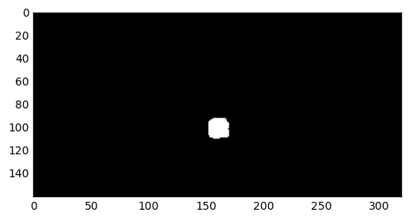
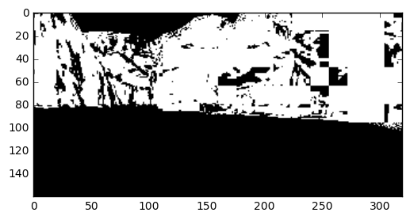
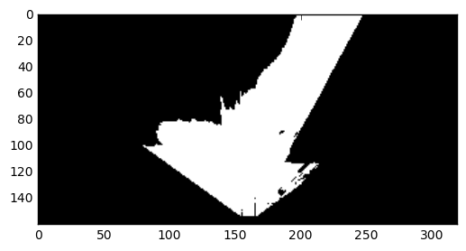
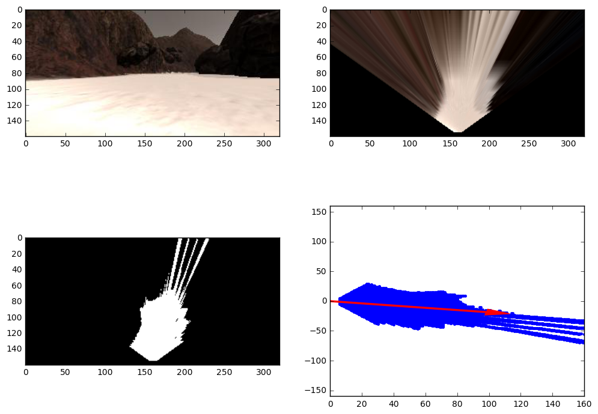
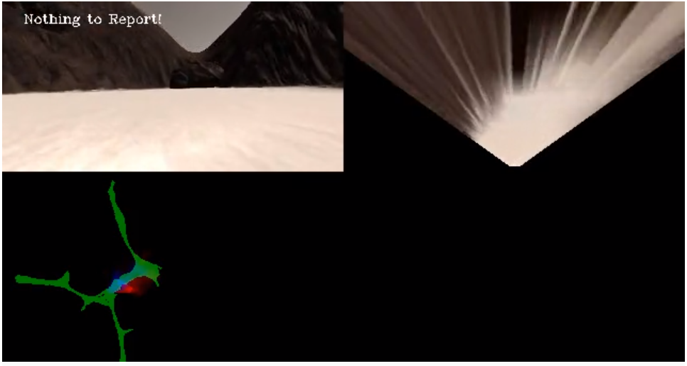
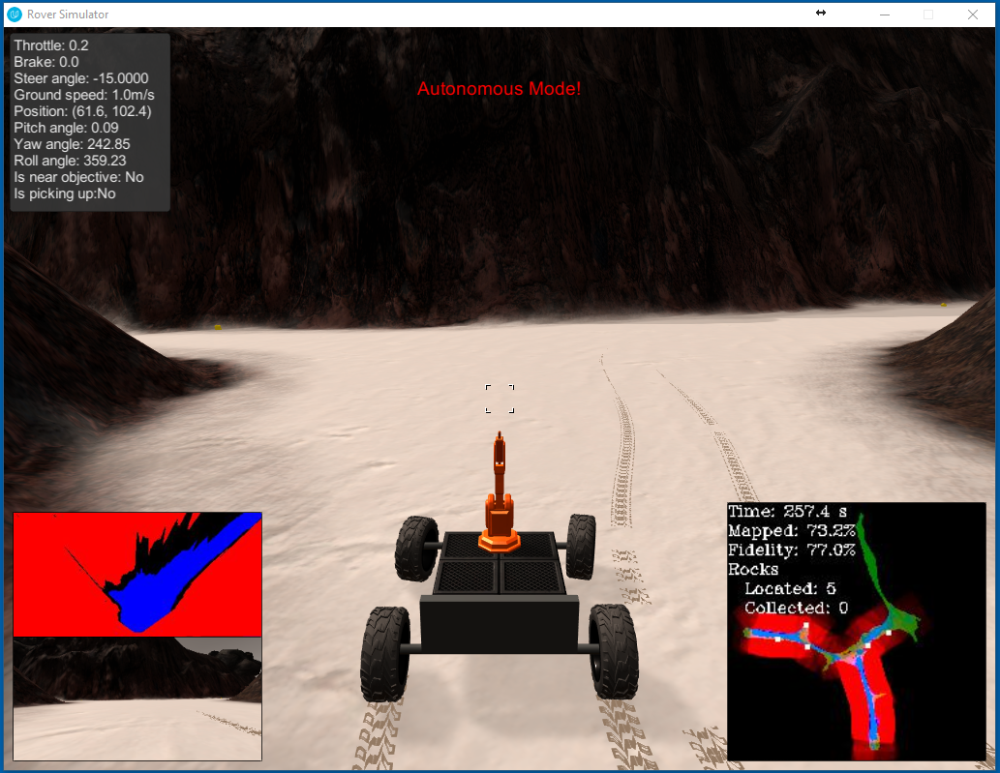
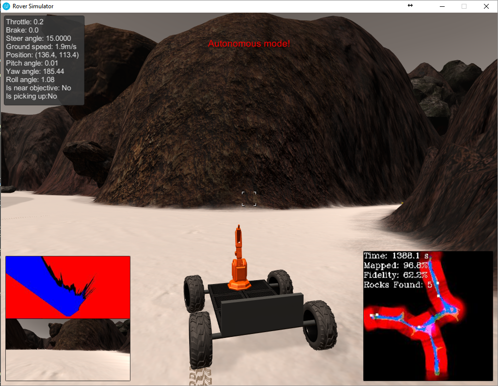

# Search and Sample Return Project
## [Rubric](https://review.udacity.com/#!/rubrics/916/view)
---
### Notebook Analysis
#### 1. Obstacle + Rock Sample Identification
I modified the color_threshold function to check if the pixel is either above or below the specified threshold.
For Rock and Obstacle detection, I first transform the image to the HSV color space.

| Object   | HSV                   | Mode    | 
|:--------:|:---------------------:|:-------:| 
| Rock     | (H= 25, S=120, V=120) | Above   |              
| Obstacle | (H=255, S=255, V=120) | Below   |

My intuition for the obstacle detector is that all the obstacles are dark colors of a variety of color shades. Therefore, the Hue and Saturation settings are not important. The Lightness setting is set to a low value to find only dark colors.

For the rock detector, I focused on the yellow color with the saturation and hue settings guarantee a robust detection across a wide range of lighting conditions. HSV is better than RGB because the detector can focus on a specific color. It is difficult to threshold the RGB color space for a wide range of yellow colors.

#### Rock Detection

#### Obstacle Detection

#### Terrain Detection

#### 2. process_image
I decided to perform the color threshold first before running the perspective transform. This change prevents spurious lines in the terrain detection, which negatively impacts the driving angle calculated from the mean of all terrain pixels. The spurious lines occur when misclassified pixels in the far background are stretched by the perspective transform into lines.

### Autonomous Navigation and Mapping
#### 1. perception_step function
This function detects the terrain, obstacles, and rocks in the image retrieved by the sensors. It updates the world map and the robot's view of the world.

#### Changes from Jupyter Notebook
 * BGR terrain detector (B=0, G=0, R=160). It is difficult to tell by looking at the world map, but this detector yields better fidelity in my simulation than the HSV detector in the jupyter notebook.  

I only update the world map if the roll and pitch are below a threshold, which prevents low fidelity measurement update. (Ln 134-140 - perception.py)
The perception function performs the perspective transform and then the color threshold. The default pipeline acquired a higher fidelity map in my experiments.

#### 2. decision_step function
This function interprets the information from the perception_step and selects the robot's next action.
The robot's behavior is represented by a finite state machine. Depending on the conditions, the robot transitions between a fixed set of sub-behaviors.

 * Reverse Mode - If the rover is stuck, reverse the rover to recover. (Ln 21-24, 46-55, 89-98 - decision.py)
 I track the cummulative distance change in the robot's position.
 If the robot's movement is below a threshold, I reverse the robot directly backwards for a fixed number of rounds.
 Afterwards, normal control is resumed.

#### 3. Rover - Autonomous Mode 
My robot scanned 73.2% of the environment with 77.0% fidelity in 257.4 seconds.
Final - (96.8% mapped with 62.2% fidelity in 1388.1 seconds) - Old Simulator

#### Simulator Settings
* Resolution: 1024 x 784
* Quality: Fantastic
* FPS: 39-42

#### Future Enhancements
* Reverse Mode Robustness
My reverse mode gets confused between being stuck with an obstacle and rotating in place. In both scenarios, the robot's position is not changing. 
A better approach is to track the number of terrain pixels. If the number is changing, then the robot is moving and not stuck.

* Steering Angle Selection
My robot uses the mean of the valid terrain points to calculate its next steering angle.
There are scenarios where an obstacle is in the robot's direct path. However, two valid paths appear on the left and right.
The mean steering angle will choose to drive straight into the obstacle.

* Obstacle Avoidance + Perception Pipeline
In addition, the current pipeline cannot distiguish between a wall or rock obstacle. Often times, the robot will turn to avoid the rock obstacle but gets stuck.
Sometimes, the reverse mode behavior cannot free the robot from the obstacle.